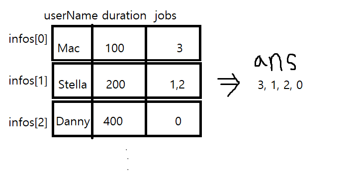

## 배치 시스템
    컴퓨터는 int [] duration과 String[] user로 나타내는 작업 목록을 가지고 있습니다. n개의 작업이 있고 각 작업은 2개의 배열로 설명됩니다. 
    i번째 작업과 관련해서 duration[i]는 작업을 완료하는 데 필요한 합계 시간, user[i]는 작업을 요청한 사용자를 식별하는 문자열입니다. 
    한 사람의 사용자는 여러 개의 작업을 요청할 수 있습니다. 컴퓨터는 한 개에 1개의 작업만을 처리할 수 있습니다. 사용자의 대기 시간은 해당 사용자가 의뢰한 모든 작업이 완료될 때까지 기다리는 시간이라고 정의합니다. 
    프로그램은 모든 사용자의 평균 대기 시간을 최소화하도록 해야 합니다.
    0부터 시작하는 n개의 작업 번호를 처리 순서로 다시 배열하고 int 자료형의 배열로 리턴해주세요. 여러 가지 결과가 나온다면 사전 순서로 정맇서 가장 앞의 결과를 리턴해주세요. 이름의 대소문자를 구분합니다.
    
### 나만의 풀이

    1. map을 통해 중복된 사용자이름 입력을 처리, 그와 동시에 한 사용자의 전체 소요시간 계산
    2. info 구조체에 이름, 총시간, 수행할 작업을 정의하고 총시간 기준으로 sorting
    3. ans 에 총시간 기준으로 정렬된 각각의 info에서 jobs를 모두꺼내서 넣는다 
    4. 정렬완료
   

```cpp
#include<vector>
#include<map>
#include<string>
#include<iostream>
#include<algorithm>
using namespace std;

auto key_selector = [](auto pair) {return pair.first; };
auto value_selector = [](auto pair) {return pair.second; };

typedef struct info
{
	string userName;
	long long duration;
	vector<int> jobs;
}INFO;

bool cmp(const INFO &p1, const INFO &p2)
{
	if (p1.duration > p2.duration) return false;
	else return true;
}

class BatchSysytem
{

public:

	vector<int> schedule(vector<int> duration, vector<string> user) {
		
		int N = duration.size();

		map<string, long long> jobTime;

		for (int i = 0; i < N; i++)
			jobTime[user[i]] += duration[i];

		int userNum = jobTime.size();


		vector<string> Keys(userNum);
		vector<long long> Values(userNum);
		transform(jobTime.begin(), jobTime.end(), Keys.begin(), key_selector);
		transform(jobTime.begin(), jobTime.end(), Values.begin(), value_selector);

		INFO *infos = new INFO[jobTime.size()];
		
		for (int i = 0; i < userNum; i++)
		{
			infos[i].userName = Keys[i];
			infos[i].duration = Values[i];
		}

		for (int i = 0; i < userNum; i++)
			for (int j = 0; j < N; j++)
				if (infos[i].userName == user[j])	infos[i].jobs.push_back(j);

		sort(infos, infos + userNum, cmp);

		vector<int> ans;
		for (int i = 0; i < userNum; i++)
		{
			vector<int>::iterator iter;
			for (iter = infos[i].jobs.begin(); iter != infos[i].jobs.end(); ++iter)
			{
				ans.push_back(*iter);
			}
		}

		return ans;
	}
};

int main()
{
	BatchSysytem bs;
	vector<int> duration = { 400, 100, 100, 100 };
	vector<string> user = { "Danny Messer", "Stella Bonasera", "Stella Bonasera", "Mac Taylor" };

	vector<int> ans = bs.schedule(duration, user);

	vector<int>::iterator iter;
	for ( iter = ans.begin(); iter != ans.end(); ++iter)
	{
		cout << *iter << endl;
	}

}
```
